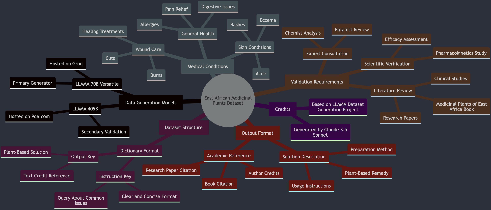

These datasets were generated by LLAMA 70B versatile by Groq and LLAMA 405B hosted on poe.com. Below is the provided prompt that generates the dataset
below. Please consult a botanist and the book medicinal plants of East Africa to confirm if these remedies are valid. In addition, talk to your 
botanist and chemist to review efficacy of the preparation of these remedies and potential pharmokinetics.  

Generate with LLAMA 70B versatile from groq

"Pretend you are a botanist specializing in medicinal plants of East Africa. Generate an instruction dataset where each instruction is a query about a common issue or problem (e.g., insect repellent, burns, eczema, rashes, food poisoning) and the output is a response providing a plant-based solution, along with a text credit referencing a relevant book or research paper.

Dataset Structure:

- Each entry should be a dictionary with two keys: 'instruction' and 'output'
- 'instruction' should be a clear and concise query about a common issue or problem
- 'output' should be a response providing a plant-based solution, formatted as a short paragraph, and including a text credit referencing a relevant book or research paper

Some possible query topics may include (but are not limited to):

* Wound healing (e.g., cuts, burns)
* Skin conditions (e.g., eczema, rashes, acne)
* Insect-borne illnesses (e.g., mosquito repellent)
* Digestive issues (e.g., diarrhea, food poisoning)
* Pain relief (e.g., headaches, arthritis)
* Allergies and asthma
* Personal hygiene and sanitation

Output responses should be concise, informative, and accurate, and should include a text credit referencing a relevant book or research paper (e.g., 'Medical Plants of East Africa by Najma et. al'). Create a dataset with 30 entries."

NB: 'Medical Plants of East Africa' is a real book. The model seems to be adding it as reference because of the original system prompt that use the book as a reference. Not sure if the book was part of the training data.  

Tasks:
- Verify if the information is accurate from other sources e.g books, websites and experts.
- Use the MOA framework for other tasks e.g coding, bioinformatics problems and math problems. Generated by Claude 3 Haiku
Prompt "Come up with question and answer pairs to test an LLM on various topics in a markdown table. Including bioinformatics problems with an empty column to score if the model was right or wrong."

| Topic | Question | Answer | Correct (✓/✗) |
| --- | --- | --- | --- |
| General Knowledge | What is the capital of France? | Paris | |
| Mathematics | What is the square root of 64? | 8 | |
| Literature | Who wrote the novel "To Kill a Mockingbird"? | Harper Lee | |
| Geography | What is the largest ocean on Earth? | Pacific Ocean | |
| History | In what year did World War II end? | 1945 | |
| Bioinformatics | What is the primary function of DNA polymerase in DNA replication? | To synthesize new DNA strands complementary to the template DNA strand | |
| Bioinformatics | What is the name of the process where a single-stranded RNA molecule is used as a template to produce a complementary DNA molecule? | Reverse Transcription | |
| Bioinformatics | What is the name of the enzyme that catalyzes the joining of Okazaki fragments during DNA replication? | DNA ligase | |
| Bioinformatics | What is the name of the process where the genetic code in DNA is used to direct the synthesis of proteins? | Transcription and Translation | |
| Bioinformatics | What is the name of the process where a DNA molecule is copied to produce an identical copy? | DNA Replication | |

Get more questions here: [Rosalind.info](https://rosalind.info) & [Problems](https://rosalind.info/problems/list-view/)    

Credit:    
Prompt edits - G1 https://github.com/bklieger-groq/g1    
Ideas about data generation - https://github.com/rasbt/LLMs-from-scratch   
Prompt edit suggestions - https://gist.github.com/philschmid/3a0ecc9e45763716f4dd9c36b6445fca   
